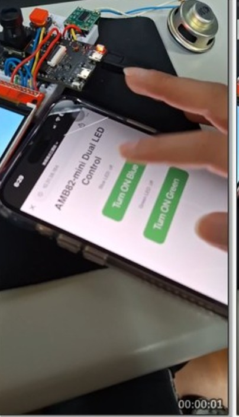
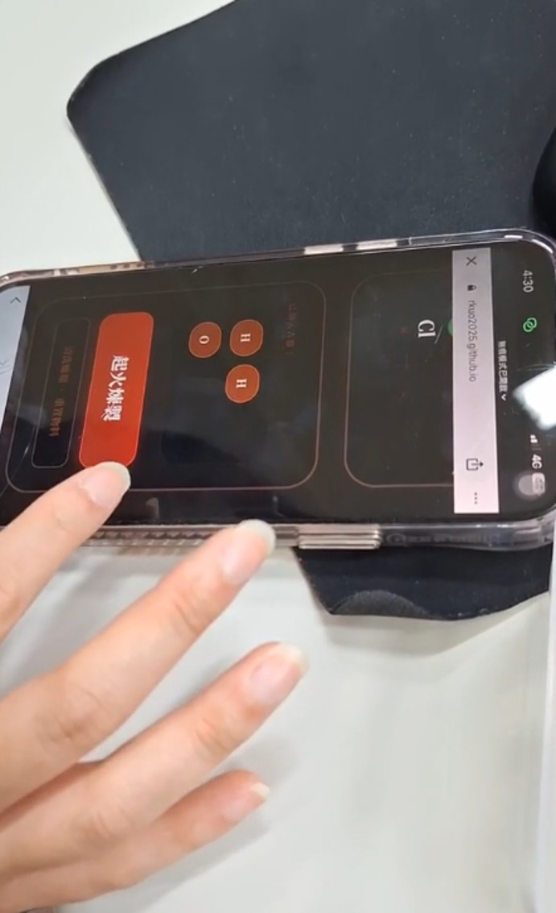
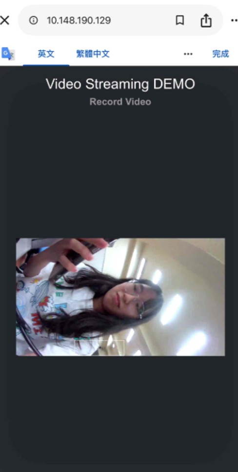
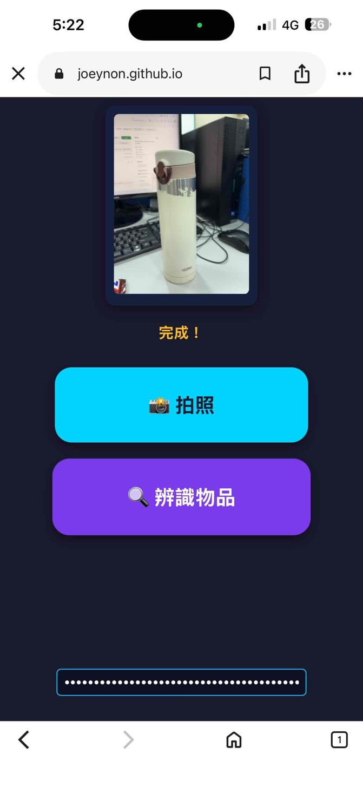
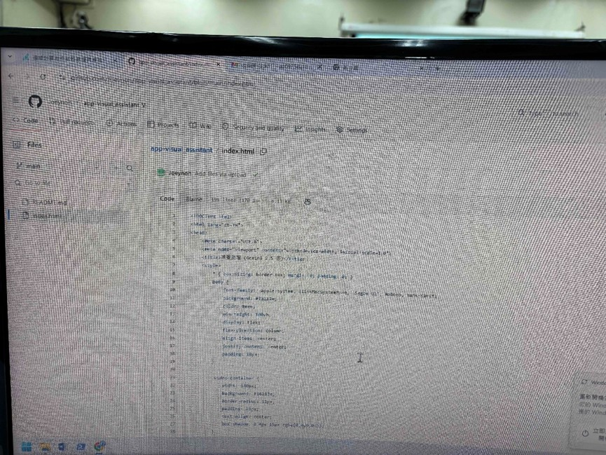
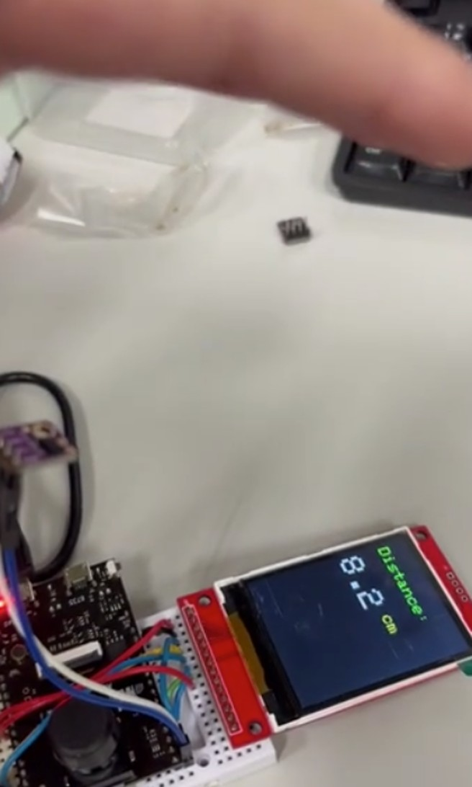
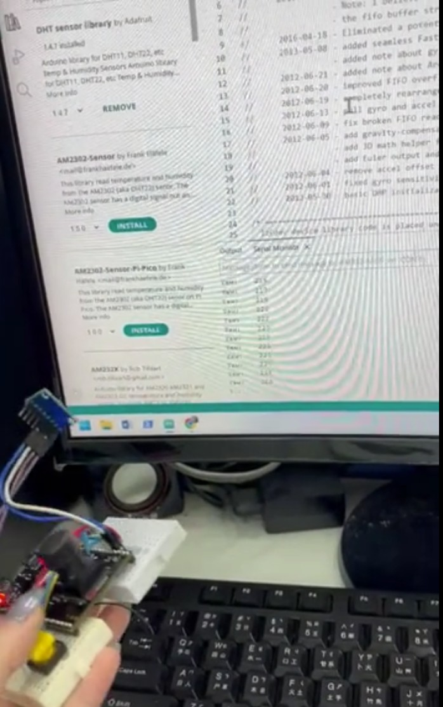
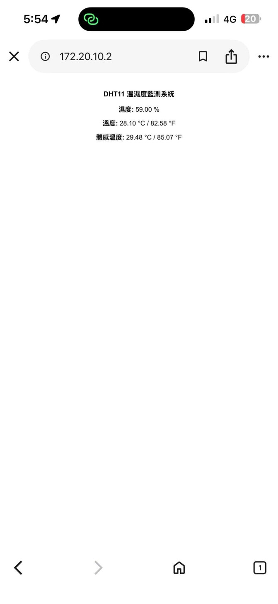

# EdgeAI MCU 課程實作完整技術報告與應用設計

本專案完整記錄了基於 **Ameba Pro2 (AMB82-mini)** 開發板進行的一系列 EdgeAI 與微處理機邊緣運算專案。內容涵蓋 Web 伺服器控制、網頁前端 Vibe Coding、YOLOv7 在地化影像辨識、硬體總線（I2C/SPI）驅動優化，以及結合多模態大語言模型（LLM）與文字轉語音（TTS）的物聯網智慧體應用。

本報告由學習者透過 `git clone` 下載儲存庫後，於本地端使用 `opencode` 工具並引導 **Big Pickle** 免費模型進行逐一檔案深度分析與格式化整合產出，兼具底層技術細節與核心硬體流程。

* **專案 GitHub 儲存庫**: `https://github.com/Joeynon/EdgeAI-MCU`
* **專案展示網頁 (GitHub Pages)**: `https://Joeynon.github.io/EdgeAI-MCU`

---

## 🛠 各項作業技術細節與流程圖詳細分析

### (一) WebServer 雙按鈕 LED 控制 (`WebServer_ControlLEDx2`)
* **硬體架構**: AMB82-mini 開發板、板載內建藍色 LED（`LED_B`）與綠色 LED（`LED_G`）。
* **技術細節 (.ino)**:
    * 呼叫 `WiFi.h` 與 `WiFiServer.h` 程式庫，將 AMB82-mini 設為 AP（熱點）或 STA（工作站）模式，並於 Port 80 建立監聽。
    * 解析來自手機型瀏覽器傳入的 HTTP GET 請求字串（例如：判斷字串中是否包含 `/inline?LED=B_ON`、`B_OFF`、`G_ON` 或 `G_OFF`）。
    * 調用核心底層 I/O 函數 `digitalWrite(LED_B, HIGH)` 與 `digitalWrite(LED_G, LOW)`，即時驅動 GPIO 的高低電平轉換，達到異步雙按鈕獨立控制的效果。
* **流程圖文字描述**:
    1. **系統初始化**：啟動序列埠（波特率 115200） $\rightarrow$ 設定 `LED_B` 與 `LED_G` 腳位模式為 `OUTPUT` $\rightarrow$ 啟動 Wi-Fi 連線並開啟 Port 80 Web Server。
    2. **主循環監聽**：程式進入 `loop()`，持續檢查是否有客戶端（手機端）發送網路請求。
    3. **請求解析與判定**：讀取 HTTP 請求標頭 $\rightarrow$ 判定字串內容 $\rightarrow$ 若包含 `B_ON`/`B_OFF` 則切換藍色 LED 電平；若包含 `G_ON`/`G_OFF` 則切換綠色 LED 電平。
    4. **回傳與釋放**：將內嵌最新控制狀態的 HTML 網頁代碼寫入 Client 回應 $\rightarrow$ 斷開客戶端連線 $\rightarrow$ 回到監聽步驟。
* **成果展現**:  
    

---

### (二) Vibe Coding 網頁動態應用 (`WebServer_ReadHTML`)
* **硬體架構**: AMB82-mini、MicroSD 記憶卡（內存由 AI 生成之 `your_app.html` 網頁檔案）。
* **技術細節 (.ino)**:
    * 引入 `AmebaFileSystem.h`（FatFs 檔案系統框架）與 `WiFi.h`。
    * 在 `setup()` 中掛載 SD 卡檔案系統，利用 `fs.open("/your_app.html")` 檢查並讀取前端化學元素煉製（如 $H_2O$ 聚合互動）網頁。
    * 當伺服器收到客戶端請求時，動態發送標準 HTTP 200 OK 標頭與 `text/html` 媒體類型，接著透過 `client.write(buf, len)` 以資料流（Stream）形式分段將 SD 卡中的 HTML 二進位數據推送至手機端。
* **流程圖文字描述**:
    1. **硬體掛載**：初始化 SD 卡檔案系統 $\rightarrow$ 確認目標 `your_app.html` 檔案就緒 $\rightarrow$ 啟動 Wi-Fi 伺服器。
    2. **建立回應**：偵測到手機瀏覽器訪問 $\rightarrow$ 發送標準 HTTP 響應標頭。
    3. **串流傳輸**：開啟 HTML 檔案 $\rightarrow$ 執行 `while(file.available())` 循環 $\rightarrow$ 將讀取出的數據快取分塊透過網路寫入 Client 端。
    4. **關閉釋放**：檔案傳輸完畢 $\rightarrow$ 關閉檔案指標 $\rightarrow$ 中斷連線。
* **成果展現**:  
    

---

### (三) YOLOv7 邊緣運算在地化監控 (`YOLOv7_Survellience`)
* **硬體架構**: AMB82-mini 板載高畫質相機鏡頭模組。
* **技術細節 (.ino)**:
    * 引入 `NNModelSelection.h` 與 `ObjectDetection.h`，加載邊緣端輕量化 YOLOv7 物件偵測類別網路模型。
    * 透過 `NTPClient.h` 以 UDP 協定與網路時間伺服器進行同步，獲取精準的年月日時分秒。
    * 修改原始 Sketch 的錄影時間判定機制，將原先限制於半夜的 `if(hour>=0 && hour<=6)` 修改為 `if(hour>=0)`，打破時段防禦，達成全天候 24 小時不間斷偵測人、車並以時間戳命名的在地化錄影監控系統。
* **流程圖文字描述**:
    1. **多媒體初始化**：配置 Video 串流通道 $\rightarrow$ 將相機影格導向 NPU 加速器 $\rightarrow$ 載入 YOLOv7 模型權重 $\rightarrow$ 同步 NTP 網路時間。
    2. **邊緣端推論**：相機採集即時影格 $\rightarrow$ NPU 進行硬體加速推論 $\rightarrow$ 篩選物件類別（如 `person`）並計算 Bounding Box（邊界框）與置信度。
    3. **時間儲存判定**：讀取當前 NTP 小時數 $\rightarrow$ 判定條件 `hour>=0`（恆成立） $\rightarrow$ 觸發儲存常式，將影像帶有時間戳檔名寫入 SD 卡，並同步於 WebSocket Viewer 網頁串流。
* **成果展現**:  
    
    

---

### (四) Vibe Coding - 盲人友善視覺助理 (`Visual Assistant`)
* **硬體架構**: 行動裝置（手機/電腦）相機硬體、GitHub Pages 雲端靜態網站託管系統。
* **技術細節 (index.html)**:
    * 調用前端 HTML5 的 `navigator.mediaDevices.getUserMedia` API 獲取硬體相機權限與即時視訊串流。
    * 利用 CSS Flexbox 佈局重構 UI/UX。針對無障礙盲人使用情境，大幅精簡介面並將按鈕面積最大化，設計高對比度配色（深色背景、鮮明青色「拍照」按鈕、紫色「辨識物品」按鈕），優化排版層級。
* **流程圖文字描述**:
    1. **環境載入**：手機瀏覽器載入發布於 GitHub Pages 的網頁 $\rightarrow$ 請求使用者的硬體相機權限 $\rightarrow$ 將即時畫面渲染至視訊預覽區。
    2. **拍照擷取**：使用者觸擊大面積「拍照」按鈕 $\rightarrow$ 透過 HTML5 Canvas 擷取當前影像影格 $\rightarrow$ 轉換為 Base64 或 Blob 編碼。
    3. **辨識與輸出**：觸擊「辨識物品」按鈕 $\rightarrow$ 將影像封包透過 API POST 傳送至雲端視覺大模型 $\rightarrow$ 模型回傳物件品項標籤文字，準備進行無障礙語音輸出。
* **成果展現**:  
    
    

---

### (五) 紅外線測距與 TFT 螢幕即時顯示 (`IR ranger + TFT display`)
* **硬體架構**: VL53L0X ToF（飛行時間）雷射測距感測器、ILI9341 TFT LCD 顯示螢幕。
* **技術細節 (.ino & .cpp)**:
    * 為避免多硬體周邊總線衝突，修改 Realtek 硬體核心套件庫中的底層驅動 `VL53L0X.cpp`：將預設的 `bus(&Wire)` 重新定向綁定為 `bus(&Wire1)`。
    * 主程式調用 `Wire1.begin()` 初始化第二組硬體 I2C 總線（SDA1, SCL1）；同時調用 `AmebaILI9341.h` 啟動 SPI 總線，並設定高頻 `ILI9341_SPI_FREQUENCY 2000000`（2MHz）確保畫面動態渲染效率。
    * 讀取感測器暫存器取得連續測距數據（公釐 mm），於程式中除以 10.0 換算為公分（cm）浮點數，再經由 `tft.print()` 刷新顯示。
* **流程圖文字描述**:
    1. **總線組態初始化**：啟動 `Wire1`（I2C1） 總線 $\rightarrow$ 啟動硬體高速 SPI 總線 $\rightarrow$ 初始化 ILI9341 TFT 顯示參數。
    2. **感測器配置**：對 VL53L0X 發送配置參數 $\rightarrow$ 開啟 Continuous（連續）測距推論模式。
    3. **數據讀取與換算**：微處理機經由 I2C1 讀取雷射回波時間暫存器 $\rightarrow$ 換算為 mm 距離值 $\rightarrow$ 數學公式轉換：$\text{cm} = \text{mm} / 10$。
    4. **LCD 渲染刷新**：定位螢幕游標 $\rightarrow$ 清除前一影格殘影 $\rightarrow$ 以高對比綠色字體繪製 `Distance: X.X cm` $\rightarrow$ 延遲刷新。
* **成果展現**:  
    

---

### (六) MPU6050 六軸感測器姿態解算 (`MPU6050_DMP_GetHeading`)
* **硬體架構**: MPU6050（內建三軸加速度計 + 三軸陀螺儀）感測器模組、I2C 總線。
* **技術細節 (.ino)**:
    * 調用 `I2Cdev.h` 與 `MPU6050_6Axis_MotionApps20.h` 擴充程式庫。
    * 配置並啟用 MPU6050 內部的 **DMP（數位運動處理器）** 硬體加速引擎，將複雜的卡爾曼濾波、四元數融合姿態解算直接在感測器端完成，大幅降低 AMB82-mini 微處理機的運算負擔。
    * 定期讀取 MPU6050 的 FIFO 緩衝區，將讀取出的四元數封包轉換解算為精準的航向角（Heading Angle / Yaw），有效消除陀螺儀偏置帶來的累積漂移。
* **流程圖文字描述**:
    1. **介面初始化**：開啟 I2C 總線與序列埠 $\rightarrow$ 測試 MPU6050硬體連線狀態。
    2. **DMP 韌體加載**：向 MPU6050 寫入 DMP 初始化參數 $\rightarrow$ 啟動板載 DMP 引擎 $\rightarrow$ 配置硬體中斷腳位（INT）。
    3. **FIFO 緩衝區輪詢**：進入 `loop()` 持續輪詢 MPU6050 FIFO 狀態暫存器 $\rightarrow$ 檢查是否有新數據包或發生溢位（Overflow）。
    4. **姿態導出**：自 FIFO 讀取 42-byte 封包 $\rightarrow$ 解算 Quaternion（四元數） $\rightarrow$ 導出歐拉角並計算 Heading 航向角 $\rightarrow$ 輸出至序列埠監控視窗。
* **成果展現**:  
    

---

### (七) 溫濕度 WebServer 監測系統 (`WebServer with DHT11`)
* **硬體架構**: DHT11 溫濕度感測器（連接至 GPIO Pin 8）、Wi-Fi 無線網路模組。
* **技術細節 (.ino)**:
    * 引入 `DHT.h` 程式庫，實例化 `DHT dht(8, DHT11)`。
    * 整合 `SimpleHttpWeb` 與 `DHT_Tester` 範例代碼。當偵測到用戶連線時，調用 `dht.readHumidity()` 與 `dht.readTemperature()` 讀取感測器之單線數位序列訊號。
    * 運用動態字串拼接技術，將溫濕度與體感溫度數據即時填入預先設計的前端網頁模板中，輸出具備質感排版的環境資訊儀表板。
* **流程圖文字描述**:
    1. **硬體與網路初始化**：啟動 DHT11 感測器核心 $\rightarrow$ 開啟 Wi-Fi 連線並指派區網 IP 位址（如 `172.20.10.2`） $\rightarrow$ 啟動 HTTP 監聽。
    2. **客戶端請求抵達**：瀏覽器訪問 WebServer。
    3. **時序訊號採集**：MCU 向 GPIO Pin 8 發送起始訊號 $\rightarrow$ 讀取 DHT11 回傳的 40-bit 溫濕度數位串列資料 $\rightarrow$ 執行 Checksum 校驗確保數據正確。
    4. **動態網頁響應**：將浮點數濕度與溫度嵌入 HTML 響應字串 $\rightarrow$ 透過 TCP 傳輸發送予手機端 $\rightarrow$ 關閉連線。
* **成果展現**:  
    

---

### (八) 多媒體大語言模型應用 (`GenAIVisionTTS`)
* **硬體架構**: AMB82-mini 相機、ILI9341 TFT 螢幕、外接音訊放大晶片與喇叭揚聲器周邊。
* **技術細節 (.ino)**:
    * 整合多媒體影音框架，結合 `Camera_2_Lcd_JPEGDEC` 實現相機影格擷取與 TFT LCD 畫面同步解碼渲染。
    * 調用 `GenAIVisionTTS` 機制，透過網路發送 HTTP POST 請求，將擷取的 JPEG 照片二進位數據上傳至雲端 Vision LLM 終端，並在提示詞參數中設定特定的**情緒音樂映射規則**（Analyze emotion... Respond in format: 'Emotion: [emotion], Song: [filename.mp3]'）。
    * 接收雲端大模型回傳之格式化文字，經由字串解析函數切開取得對應檔名（如 `APT.mp3`），隨後調用板載音訊解碼驅動，讀取 SD 卡中對應之 MP3 檔案，經由音訊腳位與外接喇叭完成智慧體聲音輸出。
* **流程圖文字描述**:
    1. **多媒體架構啟動**：初始化影音串流配置 $\rightarrow$ 掛載儲存 MP3 聲音檔之 SD 卡 $\rightarrow$ 連接網路。
    2. **影像捕捉與即時預覽**：觸發相機快門 $\rightarrow$ 影像寫入記憶體快取，同時利用 JPEG 解碼器將影像呈現在 TFT 螢幕上。
