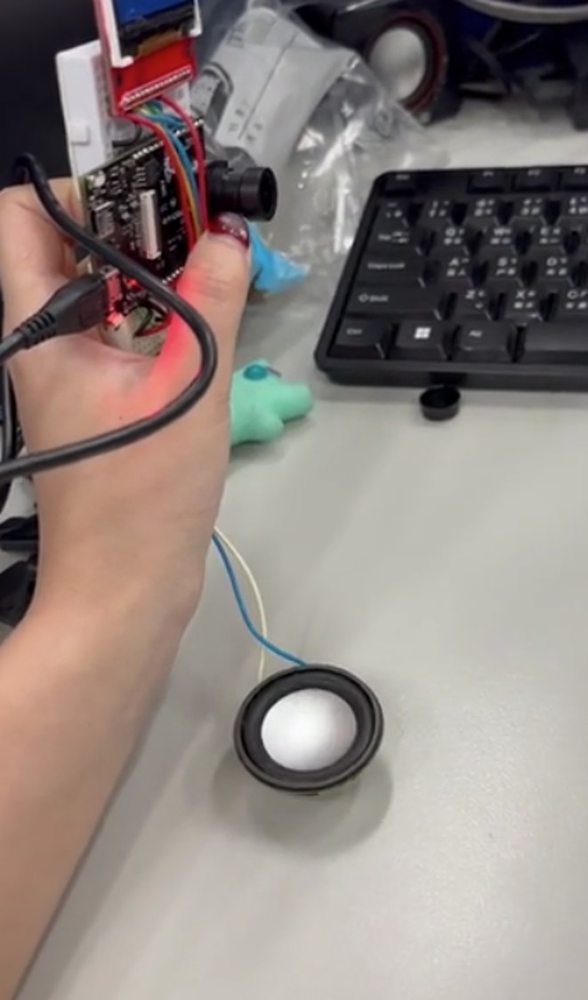

# EdgeAI MCU 課程實作完整技術報告與應用設計

本專案完整記錄了基於 **Ameba Pro2 (AMB82-mini)** 開發板進行的一系列 EdgeAI 與微處理機邊緣運算專案。內容涵蓋 Web 伺服器控制、網頁前端 Vibe Coding、YOLOv7 在地化影像辨識、硬體總線（I2C/SPI）驅動優化，以及結合多模態大語言模型（LLM）與文字轉語音（TTS）的物聯網智慧體應用。

本報告由學習者透過 `git clone` 下載儲存庫後，於本地端使用 `opencode` 工具並引導 **Big Pickle** 免費模型進行逐一檔案深度分析與格式化整合產出，兼具底層技術細節與核心硬體流程。

* **專案 GitHub 儲存庫**: `https://github.com/Joeynon/EdgeAI-MCU`
* **專案展示網頁 (GitHub Pages)**: `https://Joeynon.github.io/EdgeAI-MCU`

---

## 🛠 各項作業技術細節與流程圖詳細分析

### (一) WebServer 雙按鈕 LED 控制 (`WebServer_ControlLEDx2`)
* **硬體架構**: AMB82-mini 開發板、板載內建藍色 LED（`LED_B`）與綠色 LED（`LED_G`）。
* **技術細節 (.ino)**:
    * 呼叫 `WiFi.h` 與 `WiFiServer.h` 程式庫，將 AMB82-mini 設為 AP（熱點）或 STA（工作站）模式，並於 Port 80 建立監聽。
    * 解析來自手機型瀏覽器傳入的 HTTP GET 請求字串（例如：判斷字串中是否包含 `/inline?LED=B_ON`、`B_OFF`、`G_ON` 或 `G_OFF`）。
    * 調用核心底層 I/O 函數 `digitalWrite(LED_B, HIGH)` 與 `digitalWrite(LED_G, LOW)`，即時驅動 GPIO 的高低電平轉換，達到異步雙按鈕獨立控制的效果。
* **流程圖描述**:
```text
[開始]
  |
  v
[初始化 WiFi 連線與啟動 WebServer]
  |
  v
[等待手機/電腦連線請求] <-------------------------+
  |                                               |
  v                                               |
[伺服器回傳 HTML 網頁 (包含綠燈/藍燈控制按鈕)]    |
  |                                               |
  v                                               |
[使用者點擊網頁按鈕並解析 HTTP 請求]              |
  |                                               |
  +--------> [若為控制 LED_G] ---> [切換綠燈狀態] -+
  |                                               |
  +--------> [若為控制 LED_B] ---> [切換藍燈狀態] -+
```
* **成果展現**:  
    

---

### (二) Vibe Coding 網頁動態應用 (`WebServer_ReadHTML`)
* **硬體架構**: AMB82-mini、MicroSD 記憶卡（內存由 AI 生成之 `your_app.html` 網頁檔案）。
* **技術細節 (.ino)**:
    * 引入 `AmebaFileSystem.h`（FatFs 檔案系統框架）與 `WiFi.h`。
    * 在 `setup()` 中掛載 SD 卡檔案系統，利用 `fs.open("/your_app.html")` 檢查並讀取前端化學元素煉製（如 $H_2O$ 聚合互動）網頁。
    * 當伺服器收到客戶端請求時，動態發送標準 HTTP 200 OK 標頭與 `text/html` 媒體類型，接著透過 `client.write(buf, len)` 以資料流（Stream）形式分段將 SD 卡中的 HTML 二進位數據推送至手機端。
* **流程圖文字描述**:
```text
[開始]
  |
  v
[初始化 WiFi 連線與 AmebaFileSystem]
  |
  v
[尋找並讀取 SD 卡內的 your_app.html 檔案]
  |
  v
[啟動 WebServer 並等待手機瀏覽器連線] <---------------+
  |                                                   |
  v                                                   |
[接收請求並將 SD 卡內的網頁內容發送給使用者]          |
  |                                                   |
  v                                                   |
[使用者在手機端操作該 HTML 應用程式 (App 執行)] ------+
```
* **成果展現**:  
    

---

### (三) YOLOv7 邊緣運算在地化監控 (`YOLOv7_Survellience`)
* **硬體架構**: AMB82-mini 板載高畫質相機鏡頭模組。
* **技術細節 (.ino)**:
    * 引入 `NNModelSelection.h` 與 `ObjectDetection.h`，加載邊緣端輕量化 YOLOv7 物件偵測類別網路模型。
    * 透過 `NTPClient.h` 以 UDP 協定與網路時間伺服器進行同步，獲取精準的年月日時分秒。
    * 修改原始 Sketch 的錄影時間判定機制，將原先限制於半夜的 `if(hour>=0 && hour<=6)` 修改為 `if(hour>=0)`，打破時段防禦，達成全天候 24 小時不間斷偵測人、車並以時間戳命名的在地化錄影監控系統。
* **流程圖文字描述**:
```text
[初始化 Camera, WiFi, SD 卡, WebSocket, NTPClient]
  |
  v
[載入 YOLOv7 神經網路模型]
  |
  v
[擷取即時影像幀 (Frame)] <---------------------------------+
  |                                                        |
  v                                                        |
[YOLOv7 模型進行物件推理，判斷是否偵測到目標]              |
  |                                                        |
  +-- (否) ------------------------------------------------+
  |
  +-- (是)
  v
[呼叫 NTPClient 取得當下時間 (年月時日分秒) 作為檔名]
  |
  v
[將影像儲存至 SD 卡，並透過 WebSocket 上傳即時串流網頁] ---+
```
* **成果展現**:  
    
    

---

### (四) Vibe Coding - 盲人友善視覺助理 (`Visual Assistant`)
* **硬體架構**: 行動裝置（手機/電腦）相機硬體、GitHub Pages 雲端靜態網站託管系統。
* **技術細節 (index.html)**:
    * 調用前端 HTML5 的 `navigator.mediaDevices.getUserMedia` API 獲取硬體相機權限與即時視訊串流。
    * 利用 CSS Flexbox 佈局重構 UI/UX。針對無障礙盲人使用情境，大幅精簡介面並將按鈕面積最大化，設計高對比度配色（深色背景、鮮明青色「拍照」按鈕、紫色「辨識物品」按鈕），優化排版層級。
* **流程圖文字描述**:
```text
[使用者開啟 GitHub Pages 網頁端]
  |
  v
[載入經過 AI 簡化與放大對比的無障礙 UI]
  |
  v
[點擊「拍照」按鈕並擷取影像]
  |
  v
[點擊「辨識物品」按鈕]
  |
  v
[透過 API 將影像傳送至雲端 VLM (視覺大語言模型)]
  |
  v
[接收辨識結果字串，並觸發裝置語音朗讀與畫面顯示]
```
* **成果展現**:  
    
    

---

### (五) 紅外線測距與 TFT 螢幕即時顯示 (`IR ranger + TFT display`)
* **硬體架構**: VL53L0X ToF（飛行時間）雷射測距感測器、ILI9341 TFT LCD 顯示螢幕。
* **技術細節 (.ino & .cpp)**:
    * 為避免多硬體周邊總線衝突，修改 Realtek 硬體核心套件庫中的底層驅動 `VL53L0X.cpp`：將預設的 `bus(&Wire)` 重新定向綁定為 `bus(&Wire1)`。
    * 主程式調用 `Wire1.begin()` 初始化第二組硬體 I2C 總線（SDA1, SCL1）；同時調用 `AmebaILI9341.h` 啟動 SPI 總線，並設定高頻 `ILI9341_SPI_FREQUENCY 2000000`（2MHz）確保畫面動態渲染效率。
    * 讀取感測器暫存器取得連續測距數據（公釐 mm），於程式中除以 10.0 換算為公分（cm）浮點數，再經由 `tft.print()` 刷新顯示。
* **流程圖文字描述**:
```text
[設定 I2C1 腳位 (SDA1, SCL1) 並呼叫 Wire1.begin()]
  |
  v
[初始化 VL53L0X (綁定 Wire1) 與 ILI9341 TFT 顯示器]
  |
  v
[觸發 VL53L0X 進行連續測距 (Continuous Mode)] <-------+
  |                                                   |
  v                                                   |
[讀取原始距離數據並換算為公分 (cm)]                   |
  |                                                   |
  v                                                   |
[清空 TFT 局部畫面，重新繪製距離數字與單位字串]       |
  |                                                   |
  v                                                   |
[短暫延遲，等待下一次讀取] ---------------------------+
```
* **成果展現**:  
    

---

### (六) MPU6050 六軸感測器姿態解算 (`MPU6050_DMP_GetHeading`)
* **硬體架構**: MPU6050（內建三軸加速度計 + 三軸陀螺儀）感測器模組、I2C 總線。
* **技術細節 (.ino)**:
    * 調用 `I2Cdev.h` 與 `MPU6050_6Axis_MotionApps20.h` 擴充程式庫。
    * 配置並啟用 MPU6050 內部的 **DMP（數位運動處理器）** 硬體加速引擎，將複雜的卡爾曼濾波、四元數融合姿態解算直接在感測器端完成，大幅降低 AMB82-mini 微處理機的運算負擔。
    * 定期讀取 MPU6050 的 FIFO 緩衝區，將讀取出的四元數封包轉換解算為精準的航向角（Heading Angle / Yaw），有效消除陀螺儀偏置帶來的累積漂移。
* **流程圖文字描述**:
```text
[初始化 I2C 總線、MPU6050 與 DMP 引擎]
  |
  v
[等待 FIFO 緩衝區資料準備就緒] <--------------------------+
  |                                                       |
  v                                                       |
[從 FIFO 讀取封包資料]                                    |
  |                                                       |
  v                                                       |
[透過 DMP 引擎硬體解算四元數 (Quaternion)]                |
  |                                                       |
  v                                                       |
[轉換為歐拉角 (Euler Angles) 並取得航向角 (Yaw)]          |
  |                                                       |
  v                                                       |
[透過 Serial Monitor 輸出精確的航向角度數據] -------------+
```
* **成果展現**:  
    

---

### (七) 溫濕度 WebServer 監測系統 (`WebServer with DHT11`)
* **硬體架構**: DHT11 溫濕度感測器（連接至 GPIO Pin 8）、Wi-Fi 無線網路模組。
* **技術細節 (.ino)**:
    * 引入 `DHT.h` 程式庫，實例化 `DHT dht(8, DHT11)`。
    * 整合 `SimpleHttpWeb` 與 `DHT_Tester` 範例代碼。當偵測到用戶連線時，調用 `dht.readHumidity()` 與 `dht.readTemperature()` 讀取感測器之單線數位序列訊號。
    * 運用動態字串拼接技術，將溫濕度與體感溫度數據即時填入預先設計的前端網頁模板中，輸出具備質感排版的環境資訊儀表板。
* **流程圖文字描述**:
```text
[初始化 WiFi 與啟動 WebServer]
  |
  v
[設定 GPIO 8 腳位並初始化 DHT11 感測器]
  |
  v
[等待瀏覽器連線請求] <------------------------------------+
  |                                                       |
  v                                                       |
[客戶端發出讀取請求，讀取 DHT11 相對濕度與溫度]           |
  |                                                       |
  v                                                       |
[計算體感溫度 (Heat Index)]                               |
  |                                                       |
  v                                                       |
[動態嵌入 HTML 字串封裝為回應發送，並關閉本次連線] -------+
```
* **成果展現**:  
    

---

### (八) 多媒體大語言模型應用 (`GenAIVisionTTS`)
* **硬體架構**: AMB82-mini 相機、ILI9341 TFT 螢幕、外接音訊放大晶片與喇叭揚聲器周邊。
* **技術細節 (.ino)**:
    * 整合多媒體影音框架，結合 `Camera_2_Lcd_JPEGDEC` 實現相機影格擷取與 TFT LCD 畫面同步解碼渲染。
    * 調用 `GenAIVisionTTS` 機制，透過網路發送 HTTP POST 請求，將擷取的 JPEG 照片二進位數據上傳至雲端 Vision LLM 終端，並在提示詞參數中設定特定的**情緒音樂映射規則**（Analyze emotion... Respond in format: 'Emotion: [emotion], Song: [filename.mp3]'）。
    * 接收雲端大模型回傳之格式化文字，經由字串解析函數切開取得對應檔名（如 `APT.mp3`），隨後調用板載音訊解碼驅動，讀取 SD 卡中對應之 MP3 檔案，經由音訊腳位與外接喇叭完成智慧體聲音輸出。
* **流程圖描述**:
```text
[初始化 WiFi, Camera, LCD, 喇叭周邊與 AI API 金鑰]
  |
  v
[進入等待拍攝狀態 (觸發按鈕或定時)] <-------------------------+
  |                                                           |
  v                                                           |
[擷取 JPEG 影像，將 Base64 影像與 Prompt 發送至雲端推理]      |
  |                                                           |
  v                                                           |
[接收 AI 生成之描述字串，顯示於 LCD 螢幕下方]                 |
  |                                                           |
  v                                                           |
[將字串發送至 TTS 服務器取得語音，並透過喇叭播放] ------------+
```
* **成果展現**:  
    

---

## 💡 EdgeAI MCU 創新應用設計：智慧庭園管家 (Smart Garden Butler)

針對 AMB82-mini 的 NPU 在地化運算與強大的多媒體軟硬體整合能力，本專案規劃了一款兼具主動生態守護與多模態交互的**智慧庭園管家**邊緣運算硬體系統。

### 1. 硬體架構與組成
* **核心控制器**: AMB82-mini 開發板（負責 NPU 推論、Wi-Fi/BLE 連線與多媒體協調）。
* **視覺與音訊模組**:
    * 高畫質相機鏡頭：用於定時擷取植物葉片、花朵影像以進行生長追蹤。
    * ILI9341 TFT 螢幕：於現場直觀呈現系統運作狀態、土壤參數與 AI 診斷結論。
    * 外接揚聲器喇叭：用於主動發出環境警告與大模型轉語音（TTS）之照顧方針播報。
* **硬體環境感測周邊**:
    * DHT11 溫濕度感測器：用以捕捉微氣候溫度與相對濕度。
    * 土壤水分感測器：經由類比數位轉換器（ADC）讀取，評估泥土乾旱程度與灌溉指標。
    * VL53L0X 紅外線測距感測器（配置於 `Wire1`）：負責偵測是否有移動物體靠近特定珍稀植栽。
* **外接執行機構**: 5V 低功耗微型水泵與繼電器模組，實現自動化、精準的給水控制。

### 2. 核心功能與應用場景
* **植物病蟲害邊緣推論與深度診斷**:  
    管家定時驅動鏡頭拍攝葉片，透過 AMB82-mini 內建 NPU 運作輕量化病害分類模型進行初步篩選。若偵測到葉片枯黃或斑點異常，系統隨即透過無線網路將高畫質影像推送至多模態大語言模型（Visual LLM）進行深度交互分析，精確診斷是否感染紅蜘蛛或白粉病，並經由外接喇叭播放語音提示（例如：「主人，這盆植物似乎有輕微紅蜘蛛蟲害，請注意環境通風並適度為葉面噴水清潔喔！」），同時在 TFT 螢幕上顯示建議配藥方針。
* **基於 YOLOv7 的主動式生態監控**:  
    裝置部署於戶外花園時，持續執行在地化 YOLOv7模型。當 VL53L0X 測距感測器偵測到不明物體瞬間靠近植物（如距離突變至 10 cm 內），系統立即擷取畫面進行物件辨識。若模型辨識出類別為 `bird`（鳥類）或 `cat`（貓隻）等可能踐踏破壞植栽的動物時，開發板將立即驅動揚聲器播放特定頻率的驅趕音效，並透過內建 Web 伺服器同步發送警報畫面至主人手機端。
* **微氣候動態平衡自動灌溉**:  
    整合 DHT11 與土壤水分感測數據，開發板即時將環境狀況繪製於 WebServer 網頁儀表板上。當土壤水分低於預設健康閥值，且 DHT11 顯示當前氣溫過高、蒸發量大時，系統將主動透過 GPIO 觸發繼電器閉合，驅動微型水泵進行精準適量澆灌，實現真正的智慧化、無人化植栽養護。
#### 系統架構圖
```text
+---------------------------------------------------------------+
|                          AMB82-mini                           |
|                                                               |
|  +--------+     +-------------+     +-------------+           |
|  | Camera | --> | VLM/YOLOv7  | --> |   LLM API   |           |
|  | (拍照) |     | (視覺/防護) |     | (推理生成)  |           |
|  +--------+     +-------------+     +-------------+           |
|                                            |                  |
|  +--------+     +-------------+            v                  |
|  |  LCD   | <-- |   TTS API   | <----------+                  |
|  | (顯示) |     | (文字轉語音)|                               |
|  +--------+     +-------------+                               |
|      ^                 |                                      |
|      |                 v                                      |
|  +---------------------------------------+      +--------+    |
|  |          周邊感測器與執行機構         |      |  喇叭  |    |
|  | (DHT11/土壤感測/VL53L0X測距/水泵)     | ---> | (語音) |    |
|  +---------------------------------------+      +--------+    |
+---------------------------------------------------------------+
```

#### 系統初始化與運作流程圖
```text
[開始]
  |
  v
[初始化 WiFi / Camera / LCD / TTS / SD 卡 / 周邊感測器]
  |
  v
[等待環境數據更新或感測器觸發]
  |
  +-----------------------------------------+
  |                                         |
  v                                         v
[常態監控：讀取 DHT11 與土壤水份]       [觸發監控：VL53L0X 偵測到物體 < 10cm]
  |                                         |
  v                                         v
[判斷水份是否低於健康閥值]              [啟動 Camera 擷取畫面]
  |                                         |
  | (是)                                    v
  v                                     [YOLOv7 進行物件辨識]
[GPIO 觸發繼電器]                           |
  |                                         | (若辨識為 bird 或 cat)
  v                                         v
[微型水泵精準澆灌]                      [驅動喇叭播放特定驅趕音效]
  |                                         |
  +-----------------------------------------+
  |
  v
[WebServer 同步更新儀表板 / 發送手機警報]
  |
  v
[結束 / 返回等待狀態]
```
---

## 📈 依據提示詞操作 AI 撰寫報告之心得體悟

本次期末報告完全依靠**提示詞工程（Prompt Engineering）**，透過本地端終端機執行 `opencode` 工作流，引導 **Big Pickle** 免費模型協同完成。這是一次極具實踐價值的「**AI 協同程式設計（Vibe Coding / Agentic Workflow）**」體驗。

在整個報告優化與撰寫的歷程中，我獲得了以下幾點深刻的體悟：

### 1. 結構化格式與效率的極致提升
AI 模型在處理多項且繁雜的嵌入式硬體實驗項目時，展現了無與倫比的**快速格式化與語法排版能力**。只要給予核心的 `.ino` 代碼或實驗特徵，它就能在數秒內產出排版嚴謹、結構分明的 Markdown 語法，並清晰推導出硬體流程圖的文字描述。這讓學習者能從瑣碎的文書排版中完全解放，將更多精力投入於嘗試不同層次（從巨觀系統應用到微觀暫存器代碼優化）的報告呈現風格。

### 2. 人類工程師在技術掌握上的主導權
雖然 AI 模型能高效產出大量文字，但正如本次流程實作中所揭示的：當檔案結構龐大或專案底層硬體通訊邏輯較為複雜時，大模型容易受到**上下文視窗（Context Window Limit）**的物理限制，導致工具呼叫產生遺漏、或對代碼邏輯產生模糊解讀。
這時，**整體技術報告的內容深度與真實性，依然百分之百取決於開發者本身在硬體細節上的掌握程度**。
* 例如：若我自己不清楚 VL53L0X 底層驅動從 `Wire` 強制改為 `Wire1` 的硬體總線切換原理，就無法發現 AI 在合併程式碼時可能產生的 I2C 腳位資源衝突。
* 在 OpenCode 環境下，採取「**單獨檔案逐一引導處理，最後再交由 AI 統整與人工微調校對**」的互動模式，才是確保 EdgeAI 微處理機專案兼具速度與深度的最紮實做法。

### 3. 無法被替代的真實學習歷程
AI 能夠依據提示詞快速寫出完美的系統架構與流程說明，但它永遠無法替代我自己在實驗室線路堆中，看見 TFT 螢幕上第一次精準跳出手部距離 `Distance: 8.2 cm` 數據時的感動；也無法複製我為了修改 `VL53L0X.cpp` 底層驅動、解決編譯錯誤時，反覆除錯所累積下來的經驗與成就感。
這些在**軟硬體底層整合、網路協議對接、周邊總線優化**中所經歷的碰撞與思維轉變，才是這份報告中最具核心價值、因人而異的寶貴學習靈魂！
